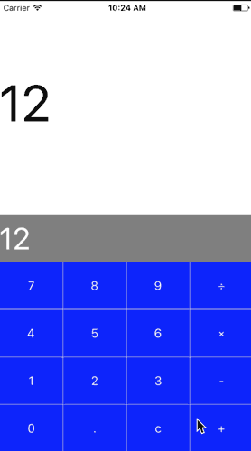

# SimpleSwiftCalculator
SimpleSwiftCalculator is a simple and customizable calculator written in Swift that can easily integrate itself in your projects.
Feel free to fork and send over your pull requests!

# Implementation
To add SimpleSwiftCalculator import the `SimpleSwiftCalculator.swift`file into to your project and make sure that your receiving `UIViewController` class complies with the `PushResultsDelegate` protocol by adding the `PushValueFromCalculator` function:
```swift
    class ViewController: UIViewController, PushResultsDelegate {
         func PushValueFromCalculator(value: String){
            // value is a string value of the returned result
         }
    }
```
You can then display the calculator whenever you want:
```swift
     let CalcInstance = SimpleSwiftCalculator(frame: CGRect(x: 0, y: 0, width: YourWidth, height: YourHeight))
     CalcInstance.becomeFirstResponder()
     CalcInstance.isUserInteractionEnabled = true
     CalcInstance.delegate = self
     self.view.addSubview(CalcInstance)
```

# Screenshot


